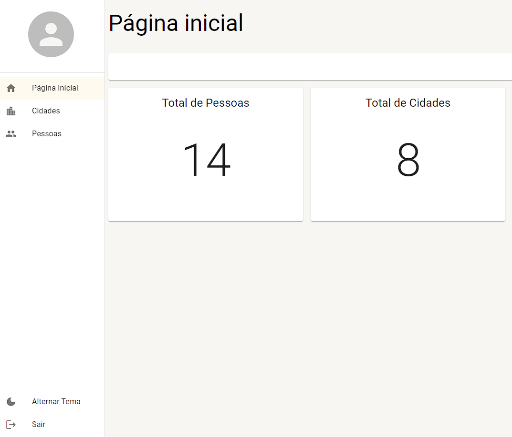

# Cadastro simples de pessoas e cidades com React, Typescript e Material ui

<br />

<div align='center' >
  
</div>

## 💻 Projeto

Iniciando com uma página simples de login inicial, após entrar contém uma página de Dashboard, mostrando o total de pessoas e cidades cadastradas, podendo adicionar, remover e editar.

#### :link: [Acesse o projeto finalizado, aqui](https://gio98sp.github.io/devLinks/)

## Características

- Login
- Logout
- Adicionar
- Remover
- Editar
- Alternar Tema

## 🚀 Tecnologias

- React
- Typescript
- Material UI
- Json-server

## Iniciar com Create React App

Esse projeto foi inicializado com Create React App

1. Primeiro clone o repositório em uma pasta executando o comando

```bash
git clone https://github.com/gio98sp/cadaster-simple-react-typescript-material-ui.git
```

2. No diretório do projeto, você pode executar o seguinte comando para instalar as dependências

```bash
npm install
```

3. Para executar o projeto, execute o seguinte comando (certifique-se de estar no diretório do projeto)

```bash
npm start
```

4. Execute também o json-server que foi utilizado para simular um backend:

```bash
npm run mock
```
